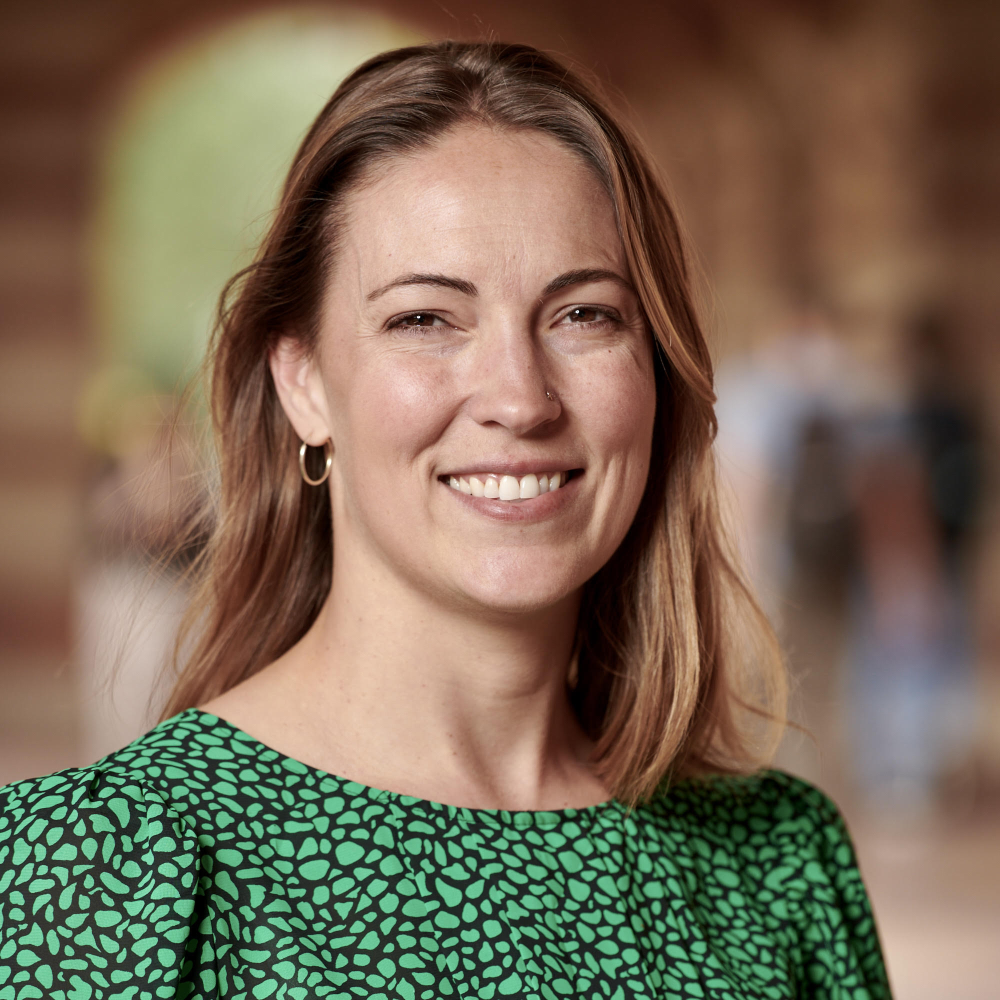

# Amelia Reese Masterson

Public health researcher and evaluator

**PhD Candidate, UCLA Fielding School of Public Health**  
**Population Health Evaluator, Cottage Health**

[CV](cv.pdf) · [Google Scholar](https://scholar.google.com/citations?user=Z48Dc7QAAAAJ&hl=en)

## About

I am a public health researcher and evaluator whose work focuses on reproductive health, migration, social policy, and equitable access to care.

My research examines how migration, social and health policies, program interventions, and health systems shape health outcomes and access to care, particularly among immigrant and refugee women and communities.

I work at the intersection of applied research, program evaluation, health equity, and public health policy.

## Areas of Work

- Reproductive health
- Migration and immigrant health
- Health equity
- Social policy and access to care
- Program evaluation
- Community health and public-sector health systems

## Applied Research & Evaluation

My work uses quantitative, qualitative, and mixed-methods approaches to study health systems, public programs, and inequities in access to care.

My applied research experience includes program evaluation, causal inference, survey research, quantitative data analysis, qualitative research, stakeholder-facing reporting, and community-based public health research.

I am particularly interested in research and evaluation that can inform public health policy, program design, implementation, and service delivery.

## Research & Publications

For an up-to-date list of publications and research outputs, see my [Google Scholar profile](https://scholar.google.com/citations?user=Z48Dc7QAAAAJ&hl=en).

## Professional Roles

**PhD Candidate**  
UCLA Fielding School of Public Health

**Population Health Evaluator**  
Cottage Health

## Links

- [Google Scholar](https://scholar.google.com/citations?user=Z48Dc7QAAAAJ&hl=en)
- [CV](cv.pdf)
- [UCSB Broom Center](https://broomcenter.ucsb.edu/people/amelia-reese-masterson)
- [Cottage Health](https://www.cottagehealth.org/population-health/team/)

## Contact

[ameliareese@g.ucla.edu](mailto:ameliareese@g.ucla.edu)
